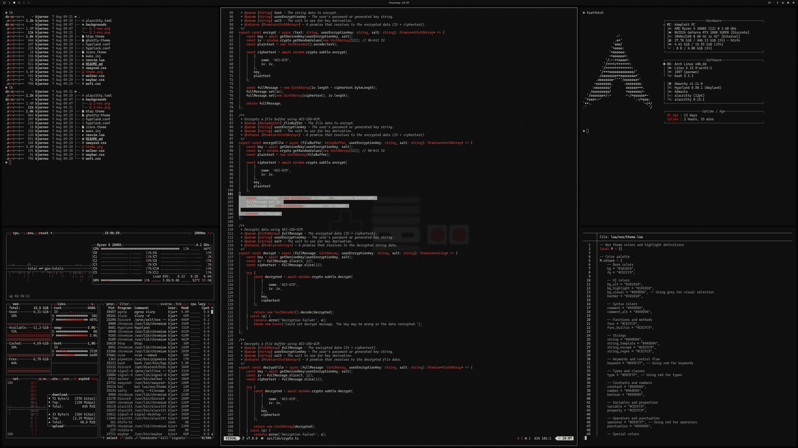

# Omarchy nes shipb Theme

Based on nes theme by bjarneo

This is the retro nes theme for [Omarchy.org](https://omarchy.org), providing a visually appealing configuration set for your Linux desktop environment.

<p align="center">
  
</p>

## Installation

To install this theme, simply use the `omarchy-theme-install` command:

```bash
omarchy-theme-install https://github.com/sweatercomeback/omarchy-nes-shipb-theme
```

## Neovim theme
[https://github.com/bjarneo/nes.nvim](https://github.com/bjarneo/nes.nvim)

## X.com
[sweatercomeback](https://x.com/sweatercomeback)
